### ML Kit Android Example Application

**Summarization & Result View**

  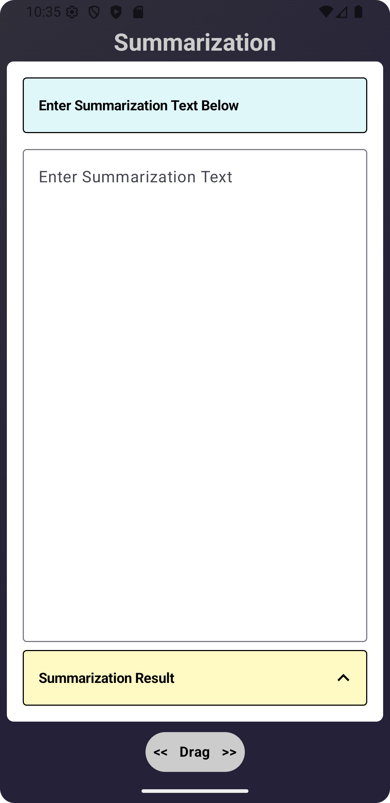
  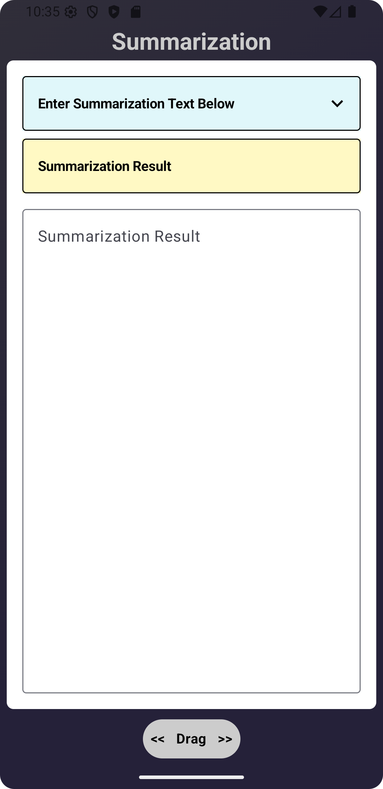

**Proofreading & Result View**

  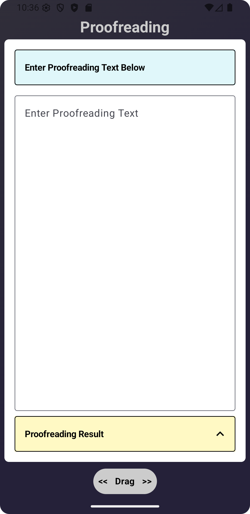
  

**Rewriting & Result View**

  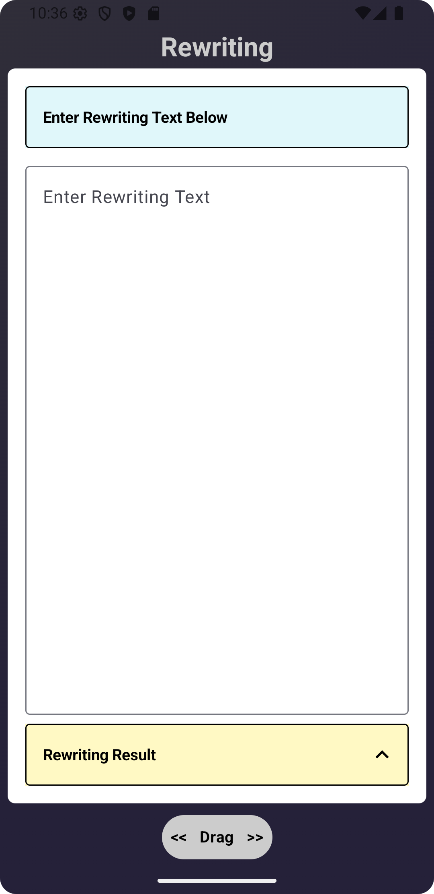
  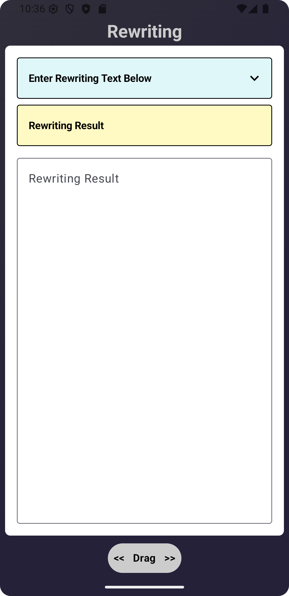

**Language Identification & Result View**

  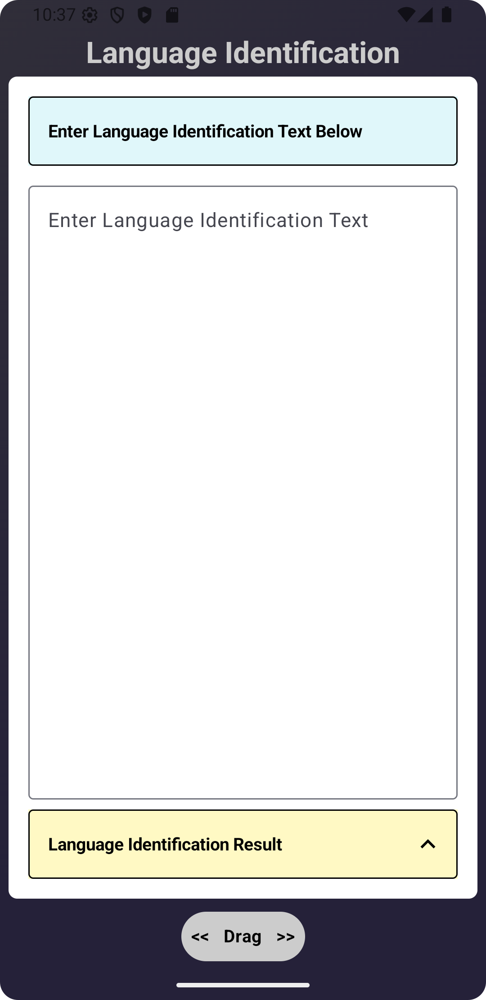
  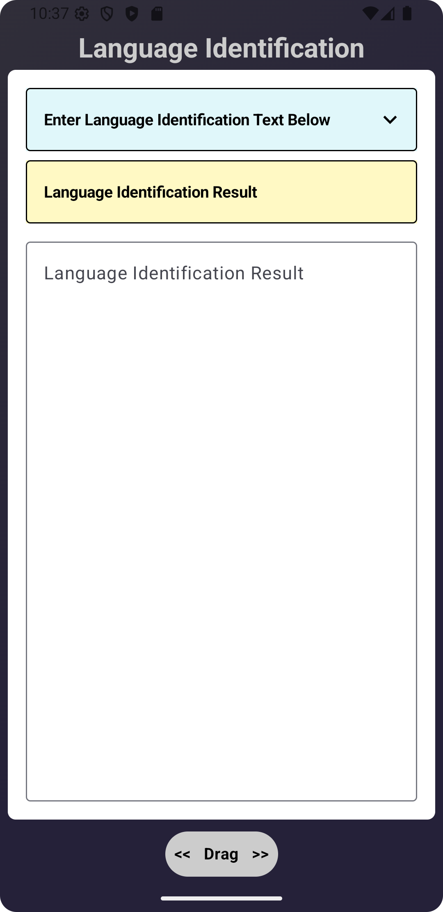

**Translation & Result View**

  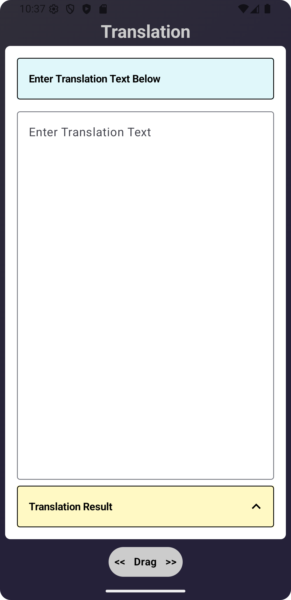
  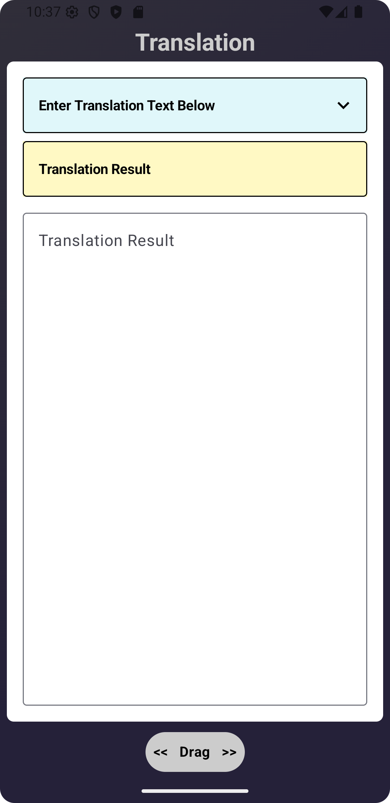

**Smart Reply & Result View**

  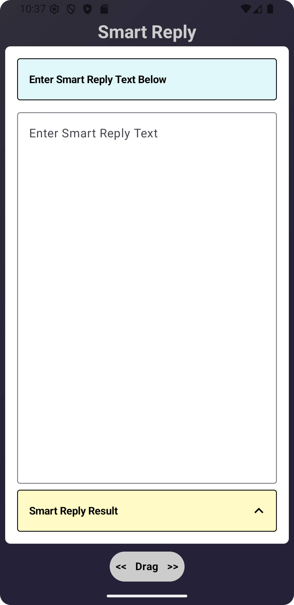
  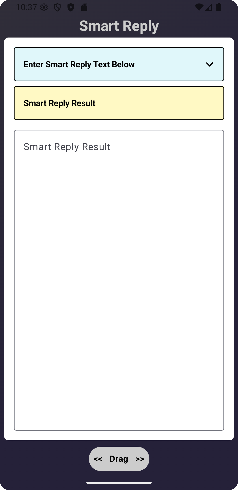

